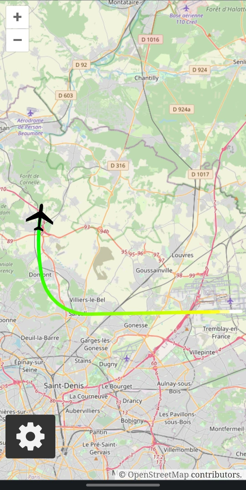

# Google Maps and OpenStreetMap for Microsoft Flight Simulator 2020


## Table of contents
* [General info](#general-info)
* [How to use](#how-to-use)
* [Troubleshooting](#troubleshooting)
* [Development setup](#development-setup)
* [Screenshots](#screenshots)

## General info
A web application that allows to monitor your flight on an interactive map from any device with a web browser.

Features:
- Google Maps and OpenStreetMap support
- Displaying route with different colors indicating aircraft's altitude (inspired by [Flightradar24](https://www.flightradar24.com/))
- Finding and displaying airports within a specified distance from the aircraft

## How to use
### Installing
1. Download the latest release from [flightsim.to](https://flightsim.to/file/28216/google-map-for-msfs) or [GitHub](https://github.com/Rybeusz100/msfs-google-maps/releases)
1. Unzip the downloaded file
### Starting
1. Navigate to the extracted folder and run the maps-server.exe file
1. When prompted, allow for the access through firewall, otherwise you won't be able to open the map from other devices
1. Follow the information displayed on screen
1. As soon as you start your flight in Flight Simulator, you should see the aircraft properly displayed on the map
### Updating
1. Delete the folder containing all of this program's files
1. Follow the installation guide again

## Troubleshooting
If your Google Maps view is grayed out and `For development purposes only` message is displayed, you'll need to provide a Google Maps API key, you can get a free trial [here](https://developers.google.com/maps) (the key has to have access to the Maps JavaScript API). After you've obtained your key, you can simply copy and paste it into `api_key.txt` file located inside your extracted folder. After your free trial has expired, you can still use the Google Maps API for free, as long as you don't exceed 200$ a month (which should be more than enough for personal use) or you can always use OpenStreetMap for free without providing any additional stuff.

## Development setup
### Requirements
- [Rustup](https://www.rust-lang.org/tools/install)
- [Clang](https://rust-lang.github.io/rust-bindgen/requirements.html)
- [Node.js](https://nodejs.org)

### Starting
1. Inside `server` directory
```
cargo run
```
2. Inside `front` directory
```
npm install
npm start
```
3. Optionally, you can start the server with a feature to make it return some data about plane's position, so that you don't need to have the simulator running
```
cargo run --features fake_route
```
4. To build the optimized version, run the `build.ps1` script

## Screenshots
<table>
    <tr>
        <td colspan="2"></img></td>
    </tr>
    <tr>
        <td colspan="2"></img></td>
    </tr>
    <tr>
        <td valign="top"></img></td>
        <td valign="top"></img></td>
    </tr>
</table>
